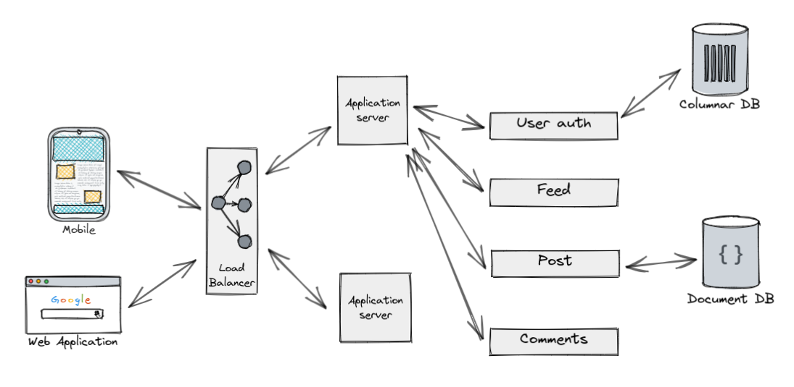
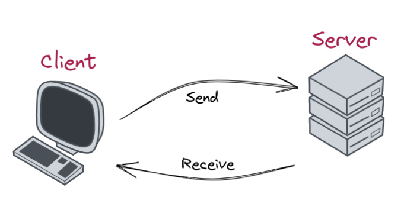
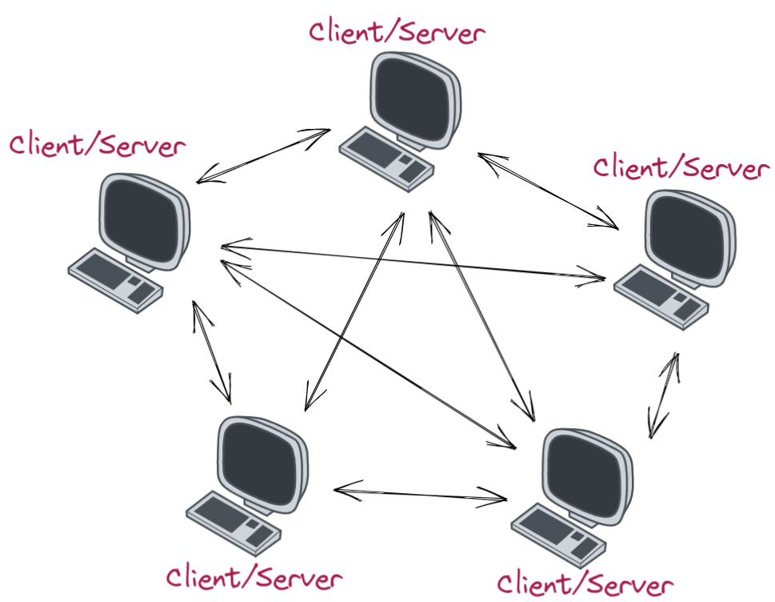

+++ {"slideshow": {"slide_type": "slide"}}

# Introduction à la programmation réseaux 

**Basile Marchand --- Centre des Matériaux - Mines Paris - Université PSL**

+++ {"slideshow": {"slide_type": "slide"}}

# Introduction

+++ {"slideshow": {"slide_type": "subslide"}}

## La coopération le concept clé de l'informatique 

AUjourd'hui la plupart des systèmes informatiques/services web que vous pouvez utiliser quotidiennement ne sont pas **une** application mais un **ensemble** d'application qui intéragissent entre elles. 

+++ {"slideshow": {"slide_type": "subslide"}}

## Le modèle coopérant le plus courant

+++ {"slideshow": {"slide_type": "subslide"}}

Le modèle coopérant le plus courant dans le monde de l'informatique met en jeu le concept de **réseau**. En effet dans le monde actuel tout est interconnecté via des réseaux. Et grâce à ce réseau il est possible de connecter tout un tas d'applications entre elles.

+++ {"slideshow": {"slide_type": "fragment"}}

Cela introduit alors tout un tas de questions : 
- comment communiquer entre deux applications sur un réseau ? 
- Comment envoyer un message d'une application vers une autre via le réseau ? 
- Sous quel format envoyer ce message ? 
- Comment fait-on une application Python capable d'écouter sur le réseau ?

+++ {"slideshow": {"slide_type": "fragment"}}

Nous allons essayer de répondre à toutes ces questions dans le cadre de ce cours.

+++ {"slideshow": {"slide_type": "subslide"}}

Le premier cas de figure, le plus répandu c'est celui où une machine A sur le réseau ne fait rien, elle ne fait qu'attendre qu'une machine B lui envoie un message pour faire quelque chose. C'est ce que l'on appelle une architecture client-serveur. La machine passive est le serveur qui ne fait rien de sa propre initiative, tandis que le machine B est le client. Dans ce modèle, c'est le client qui envoie un message au serveur en attente, ce dernier traite alors le message et envoie une réponse au client. Il s'agit du modèle le plus courant, une grande partie d'Internet repose dessus.

+++ {"slideshow": {"slide_type": "subslide"}}

À partir de cette architecture client-serveur on peut dériver les *architectures trois-tiers* qui vont nous permettre de spécialiser les serveurs dans une tâche précise. L'idée, que l'on peut deviner vu le nom, c'est d'ajouter une troisième couche dans l'architecture. Lorsque le client A envoie un message au serveur B ce dernier traite le message et suivant la demande du client il le transfère à un serveur C qui sera chargé de traiter l'action.

+++ {"slideshow": {"slide_type": "subslide"}}

Et enfin le dernier type d'architecture envisageable, et dont vous avez peut-être déjà entendu parler, c'est l'architecture pair à pair (ou peer-to-peer) très célèbre à une époque où Netflix n'existait pas, oui oui je vous assure Netflix n'a pas toujours existé... Le principe de l'architecture peer-to-peer est que les machines A et B jouent toutes les deux à la fois le rôle du serveur et le rôle du client. L'intérêt principal de cette architecture est qu'elle permet de s'affranchir d'un serveur centralisé. En effet tous les ordinateurs du réseau étant des serveurs il n'y a pas besoin de tout centraliser sur une seule et unique machine.

+++ {"slideshow": {"slide_type": "fragment"}}

Au passage on peut citer un projet qui dure depuis 20 ans de calcul parallèle distribué utilisant un réseau peer-to-peer, il s'agit du projet www.foldingathome.org. Pour l'anecdote dans le cadre de la pandémie Covid-19 le projet Folding@home a alloué une grande partie de ses ressources à la recherche d'un anticorps efficace. Suite à une mobilisation dans le cadre de la lutte contre le Covid-19 la puissance agrégée de toutes les machines du réseau folding@home a fait de ce projet la première puissance de calcul mondiale loin devant les plus gros cluster au monde.

+++ {"slideshow": {"slide_type": "subslide"}}

Dans la suite de ce cours nous ne nous focaliserons que sur l'architecture client-serveur classique.

+++ {"slideshow": {"slide_type": "slide"}}

## Et le Web dans tout ça

+++ {"slideshow": {"slide_type": "subslide"}}

La dessus vous vous dites certainement, ok mais le réseau c'est le web non ? Et bien non le réseau ce n'est pas le web, ni internet. Des réseaux il y en a partout. Alors oui c'est vrai internet c'est le réseau que l'on voit le plus mais ce n'est pas le seul. De plus internet est plus un réseau de réseaux. 

Donc ce cours ne nous permettra pas de programmer du réseau sur internet ? J'ai pas dis ça donc restez encore un peu. Je dis juste que le Web n'a rien de mystique il est bâti sur des concepts qui existaient avant. Et donc rassurez-vous tout ce que nous allons voir dans la suite de ce cours s'appliquera aussi bien à du Web qu'à un réseau local coupé d'internet. 

De plus j'ajouterai que même si la finalité du cours n'est pas que vous deveniez des experts du Web mais plutôt que vous ayez une connaissance générale sur les réseaux, cela va vous permettre de mieux comprendre ce qui se passe dans votre navigateur et aussi de mieux exploiter la richesse d'internet.

+++ {"slideshow": {"slide_type": "slide"}}

## Un mot sur le cloud

+++ {"slideshow": {"slide_type": "subslide"}}

Pour finir étant de nature vindicative je vais ajouter quelques mots sur le cloud !! Le cloud, ce mot à la mode depuis maintenant quelques années. Pour être clair tout de suite ce que l'on appelle le cloud n'a rien de révolutionnaire. Ce n'est qu'un effet de mode qui consiste à vendre le fait d'utiliser un ordinateur distant sur un réseau ouvert (par exemple internet) comme étant quelque chose de révolutionnaire !! Alors qu'en fait on faisait cela bien avant que le mot cloud n'ait été utilisé.

